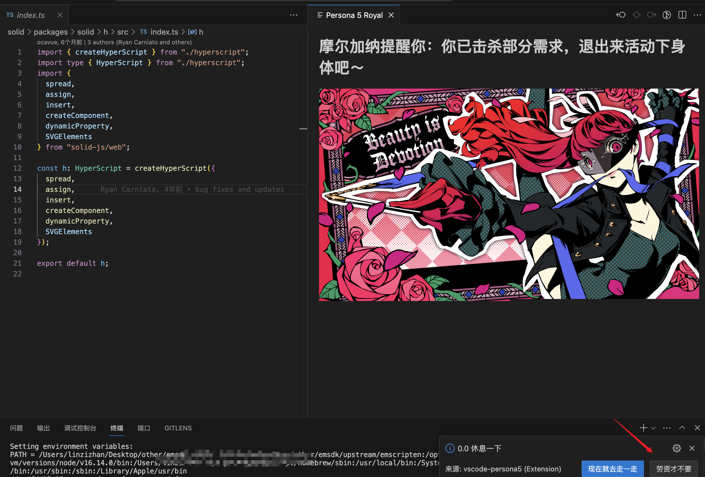
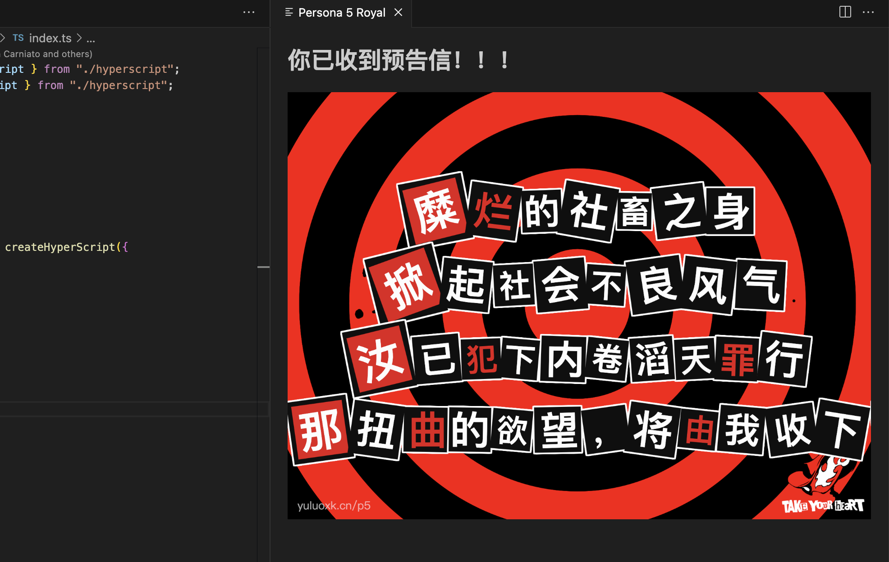
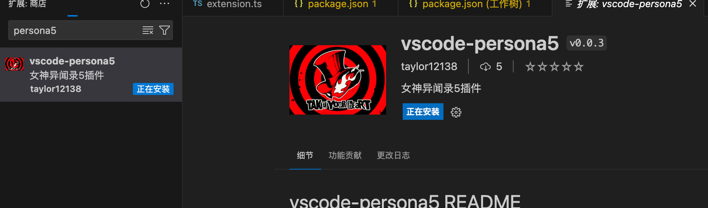

# vscode-persona5 README

欢迎来到Persona插件～，在 VS Code 中连续写代码一小时（时间可配置），将会收到p5彩蛋～

## 使用

vscode 闹钟插件 p5党自取/:rose[Wow]
- 连续工作1小时将会收到彩蛋提醒你“起身走动” 
- 如果在弹窗中拒绝，则会在1小时后收到怪盗预告信
后续优化list ：
- UI优化
- 击杀音动效支持
欢迎issue 我

除了每过一小时会自动弹出提醒页面，也可以按 `shift+commend+p`, 然后输入 `persona`来打开提醒页面





## 配置

* `persona.minutes`: 展示提醒页面的时间间隔（分钟）。(默认值为**60**)
* `persona.tip`: 提示文字。 (默认值为**小哥哥，小哥哥，代码写久了，该休息啦~**)
* `persona.type`: default (默认图)；url (图片地址)。(默认值为**default**)
* `persona.customImages`: 配置图片数组（需要搭配persona.type为url） (默认值为**空数组**)

```
如下例子，使用自定义图片：
"persona.type": "url",
"persona.customImages": [
    "https://encrypted-tbn0.gstatic.com/images?q=tbn:ANd9GcTd1zxaRny6rLB-93Mmk6Jrq69-FiU_Yx2TOB4NP2DeswfnECfnJvKaOs9JKyfivurALZw&usqp=CAU"
]
```
## 如何使用本地图片作为展示图片

* vscode不允许读取外部文件路径，所以只能自己去替换插件内的图片。替换步骤如下：
  
  1、找到vscode插件安装的地方 (如mac 在~/.vscode/extensions/taylor12138.vscode-persona5-{version})
  
  2、替换images/persona